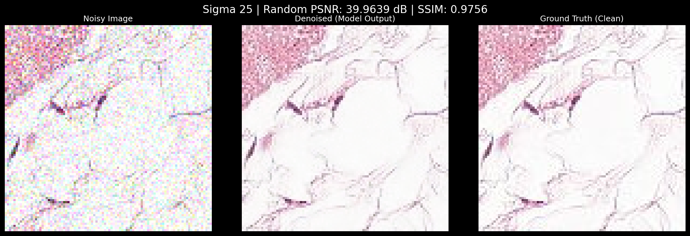
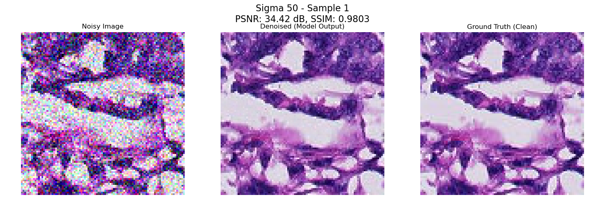

# IRUFormer-GR: Pushing the Limits of Blind Gaussian Denoising in Digital Pathology

[](https://www.tensorflow.org/)
[](https://www.python.org/)
[](https://opensource.org/licenses/MIT)

## 📄 Abstract

Image noise in digital pathology degrades the diagnostic accuracy of AI-based systems. Existing denoisers are typically non-blind, requiring prior knowledge of the noise type and level. This study introduces **IRUFormer-GR**, an architecture incorporating a transformer bottleneck and Global Residual Learning for the blind denoising of histopathological images. Gaussian noise with standard deviation ($\sigma \in [0,50]$) was applied to the training images without explicit noise-level maps. 

The model was trained on **220,025** histopathological images from the **Histopathologic Detection Dataset** and tested on **57,458** images, achieving an average Peak Signal-to-Noise Ratio (**PSNR**) of **41.14 dB** and a Structural Similarity Index (**SSIM**) of **0.9931**. It outperformed state-of-the-art (SOTA) models—including BM3D, DnCNN, Residual MID, DRAN, and the baseline IRUNet—in both metrics.

## 🏗️ Model Architecture

The IRUFormer-GR architecture is designed for robust Gaussian denoising, capable of preserving image details and global context.

### Key Contributions:
- **Global Residual Learning (GRL)**: The model predicts the noise mapping $F(x^*)$ and subtracts it from the corrupted input $x^*$, rather than generating the clean image directly.
- **Transformer Bottleneck**: Incorporates a 2D Vision Transformer block capable of capturing long-range dependencies in the compressed image patch (using 2 attention heads and a key dimension of $d_k = 24$).
- **Inception-SE Blocks**: Modified Inception modules followed by Squeeze-and-Excitation (SE) blocks to extract multiscale information and model inter-channel relationships effectively.
- **Optimization**: Trained using **Mean Absolute Error (MAE)** to prevent over-smoothing and maintain cellular details.

*(Architecture details can be found in the included project documentation).*

## 📊 Performance & Results

### Quantitative Evaluation
Comparison under purely Gaussian noise ($\sigma \in \{10, 25, 50\}$):

| Model | Avg PSNR (dB) | Avg SSIM |
| :--- | :---: | :---: |
| BM3D | 24.45 | 0.5320 |
| DnCNN | 27.82 | 0.7047 |
| **IRUFormer-GR (Ours)** | **41.14** | **0.9931** |

### Training Progress


### Qualitative Comparison
Visual results across different noise levels:

| Sigma ($\sigma$) | Noisy Input | IRUFormer-GR Reconstruction |
| :---: | :---: | :---: |
| **10** |  |  |
| **25** |  |  |
| **50** |  |  |

## 🚀 How to Reproduce

To repeat the process and achieve the results reported in the paper:

### 1. Requirements
Install the necessary dependencies:
```bash
pip install -r requirements.txt
```

### 2. Dataset
Download the **Histopathologic Cancer Detection** dataset from Kaggle:
[Kaggle Dataset Link](https://www.kaggle.com/c/histopathologic-cancer-detection/data)

Place the images in a `data/` directory.

### 3. Noise Generation & Testing
To evaluate the model on the test set:
1. Ensure your test images are in `data/test`.
2. Open and run `notebooks/evaluation.ipynb`. This notebook handles synthetic noise generation ($\sigma \in [0, 50]$) and performs the evaluation on 57,458 images.

### 4. Training (Grid Search)
To re-train the model or perform hyperparameter optimization:
```bash
export PYTHONPATH=$PYTHONPATH:.
python src/scripts/grid_search.py
```

## 📁 Repository Structure

```text
IRUFormer-GR-repository-v2/
├── assets/
│   └── images/              # Architecture diagrams and result visualizations
├── notebooks/
│   └── evaluation.ipynb    # Comprehensive test and evaluation notebook
├── results/
│   ├── training_history.csv # Training logs (PSNR, SSIM, Loss)
│   └── models/              # (Optional) Place trained .keras models here
├── src/
│   ├── models/
│   │   └── iruformer_gr.py  # Model architecture implementation
│   ├── scripts/
│   │   └── grid_search.py   # Hyperparameter optimization script
│   └── utils/
│       ├── data_loaders.py  # TF Data pipeline and preprocessing
│       ├── metrics.py       # Custom losses (MAE, Combined) and metrics
│       └── test_utils.py    # Noise generation and test helpers
├── README.md
└── requirements.txt
```

## 🤖 AI Disclosure
The author discloses the use of large language models (LLMs), specifically **Gemini**, for paraphrasing, language adaptation, and code structuring tasks via the **Gemini CLI**.

---
*Developed by Ricardo Vidal Cuadrado - San Pablo CEU University, Madrid (Spain)*
