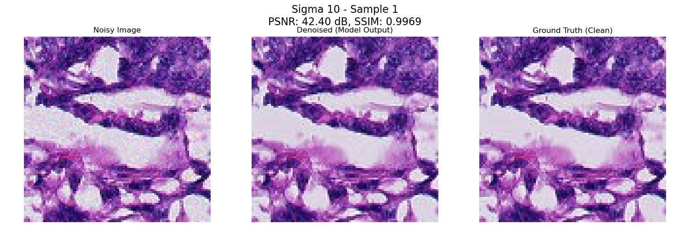
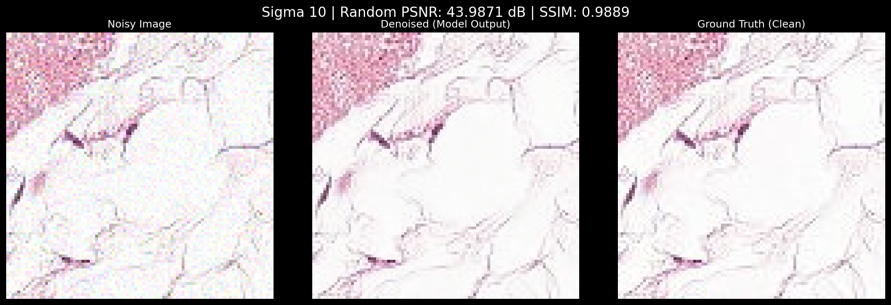
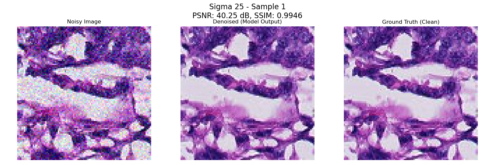
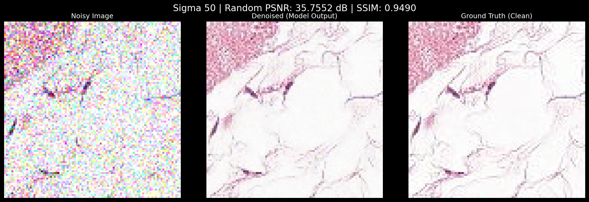

# IRUFormer-GR: Pushing the Limits of Blind Gaussian Denoising in Digital Pathology

## 📄 Abstract

Image noise in digital pathology degrades the diagnostic accuracy of AI-based systems. Existing denoisers are typically non-blind, requiring prior knowledge of the noise type and level. This study introduces **IRUFormer-GR**, an architecture incorporating a transformer bottleneck and Global Residual Learning for the blind denoising of histopathological images. Gaussian noise with standard deviation (sigma between 0 and 50) was applied to the training images without explicit noise-level maps. 

The model was trained on **220,025** histopathological images from the **Histopathologic Detection Dataset** and tested on **57,458** images, achieving an average Peak Signal-to-Noise Ratio (**PSNR**) of **41.14 dB** and a Structural Similarity Index (**SSIM**) of **0.9931**. It outperformed state-of-the-art (SOTA) models—including BM3D, DnCNN, Residual MID, DRAN, and the baseline IRUNet—in both metrics.

Although IRUFormer-GR is computationally heavier than some alternative models, it proved to be the most accurate architecture tested on this dataset for reconstructing microscopy images. Its ability to maintain structural integrity and borders across unknown noise levels makes this model highly suitable for real-world clinical applications.

## 🏗️ Model Architecture

The IRUFormer-GR architecture is designed for robust Gaussian denoising, capable of preserving image details and global context.

### Key Contributions:
- **Global Residual Learning (GRL)**: The model predicts the noise mapping and subtracts it from the corrupted input, rather than generating the clean image directly.
- **Transformer Bottleneck**: Incorporates a 2D Vision Transformer block capable of capturing long-range dependencies in the compressed image patch (using 2 attention heads and a key dimension of 24).
- **Inception-SE Blocks**: Modified Inception modules followed by Squeeze-and-Excitation (SE) blocks to extract multiscale information and model inter-channel relationships effectively.
- **Optimization**: Trained using **Mean Absolute Error (MAE)** to prevent over-smoothing and maintain cellular details.

*(Detailed architecture schematics are available in the project documentation).*

## 📊 Performance & Results

### Quantitative Evaluation
Comparison under purely Gaussian noise (sigma = 10, 25, 50):

#### Para $\sigma = 10$
| Model | Avg PSNR (dB) | Avg SSIM |
| :--- | :---: | :---: |
| BM3D* | 28.19 | 0.6670 |
| DnCNN | 35.26 | 0.8119 |
| Residual MID | 36.93 | 0.8769 |
| DRAN | 39.36 | 0.9735 |
| IRUNet (Original) | 42.20 | **0.9977** |
| **IRUFormer-GR (Ours)** | **44.49** | 0.9976 |

#### For $\sigma = 25$
| Model | Avg PSNR (dB) | Avg SSIM |
| :--- | :---: | :---: |
| BM3D* | 25.02 | 0.5042 |
| DnCNN | 26.70 | 0.7976 |
| Residual MID | 29.23 | 0.8518 |
| DRAN | 29.98 | 0.8993 |
| IRUNet (Original) | 39.64 | 0.9925 |
| **IRUFormer-GR (Ours)** | **41.49** | **0.9948** |

#### Para $\sigma = 50$
| Model | Avg PSNR (dB) | Avg SSIM |
| :--- | :---: | :---: |
| BM3D* | 20.14 | 0.4248 |
| DnCNN | 21.49 | 0.5046 |
| Residual MID | 21.65 | 0.5652 |
| DRAN | 28.06 | 0.8198 |
| IRUNet (Original) | 33.31 | 0.9655 |
| **IRUFormer-GR (Ours)** | **35.40** | **0.9836** |

### Training Metrics


### Qualitative Results
The following samples demonstrate the model's performance across different noise intensities. Each image shows the **Original Ground Truth**, the **Noisy Input**, and **Our Reconstruction**.









## 🚀 Reproduction Guide

To repeat the process and achieve the results reported in the paper:

### 1. Environment Setup
Install the necessary dependencies using pip:
```bash
pip install -r requirements.txt
```

### 2. Dataset Acquisition
Download the **Histopathologic Cancer Detection** dataset from Kaggle:
[Kaggle Dataset Link](https://www.kaggle.com/c/histopathologic-cancer-detection/data)

Place the training and test images in the `data/` directory.

### 3. Evaluation
To evaluate the model on the full test set:
1. Place test images in `data/test`.
2. Run the `notebooks/evaluation.ipynb` notebook. It is configured to handle synthetic noise generation and perform the evaluation on the full 57,458 images.

### 4. Training & Optimization
To re-run the architecture search or train from scratch:
```bash
export PYTHONPATH=$PYTHONPATH:.
python src/scripts/grid_search.py
```

## 📁 Repository Structure

```text
IRUFormer-GR-repository-v2/
├── assets/
│   └── images/              # Result visualizations and training graphs
├── notebooks/
│   └── evaluation.ipynb    # Comprehensive test and evaluation notebook
├── results/
│   └── training_history.csv # PSNR, SSIM, and Loss logs
├── src/
│   ├── models/
│   │   └── iruformer_gr.py  # IRUFormer-GR Model Architecture
│   ├── scripts/
│   │   └── grid_search.py   # Hyperparameter optimization script
│   └── utils/
│       ├── data_loaders.py  # Data pipelines (tf.data)
│       ├── metrics.py       # Custom loss functions and metrics
│       └── test_utils.py    # Noise generation and test helpers
├── README.md
└── requirements.txt
```

---
**Developed by Ricardo Vidal Cuadrado**  
*San Pablo CEU University, Madrid (Spain)*
